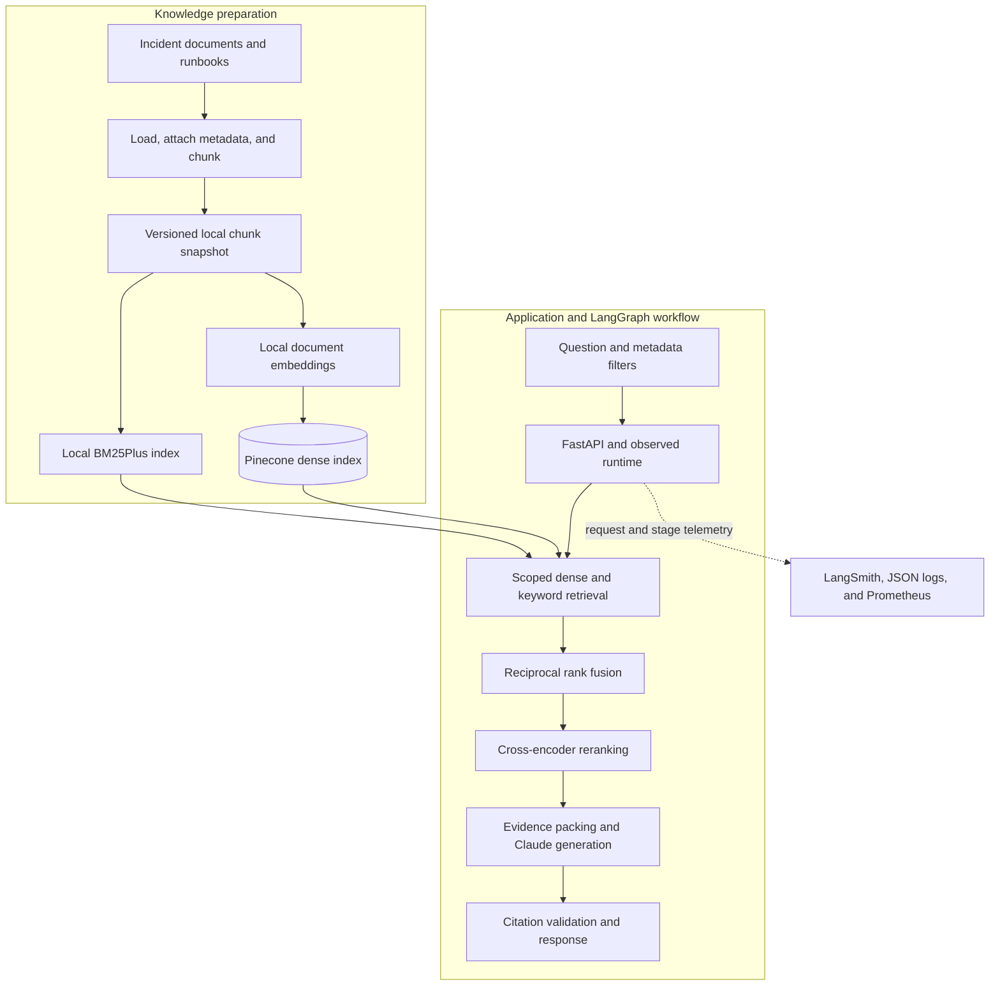
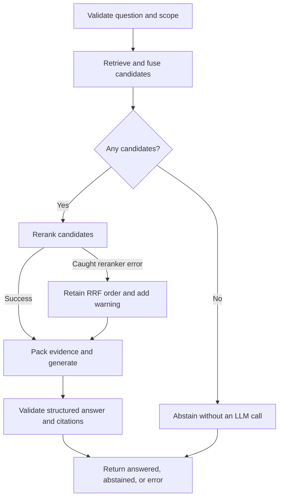

# Production Incident Knowledge Assistant

A hybrid retrieval-augmented generation (RAG) application that answers questions about recorded incidents and runbooks using approved, relevant evidence.

The pipeline combines **Pinecone dense retrieval**, **local BM25Plus keyword retrieval**, **reciprocal rank fusion (RRF)**, a **local cross-encoder reranker**, and **Claude generation**. LangGraph coordinates the workflow. Evaluation suites measure retrieval, reranking, generation, and end-to-end behavior; LangSmith and Prometheus provide operational visibility.

Example questions:

- “What caused the previous orders-consumer lag incident?”
- “What should I check when logs show `max.poll.interval.ms` expiration?”
- “Why did payments-api exhaust PostgreSQL connections in the recorded incident?”
- “What evidence is missing before we can confirm the current root cause?”

The application returns cited claims, source references, and missing information. It can abstain when evidence is unavailable or insufficient. Historical incidents provide investigation guidance; they do not establish the root cause of a new incident.

> **Project scope:** This is a working local RAG application with evaluation and observability foundations. It does not investigate live telemetry, execute SQL, modify repositories, create Jira tickets, or deploy changes. Those capabilities would require additional tools, authorization, and approval workflows.

## Contents

- [High-level architecture](#high-level-architecture)
- [Request workflow](#request-workflow)
- [Technology choices](#technology-choices)
- [Project organization](#project-organization)
- [Setup and quick start](#setup-and-quick-start)
- [Configuration](#configuration)
- [Knowledge ingestion and metadata](#knowledge-ingestion-and-metadata)
- [Retrieval and generation mechanics](#retrieval-and-generation-mechanics)
- [API and command-line usage](#api-and-command-line-usage)
- [Evaluation](#evaluation)
- [Observability](#observability)
- [Fallbacks and failure behavior](#fallbacks-and-failure-behavior)
- [Operational improvement roadmap](#operational-improvement-roadmap)
- [Troubleshooting](#troubleshooting)
- [Development and current limitations](#development-and-current-limitations)
- [References](#references)

## High-level architecture



This diagram shows the main data dependencies. Dense retrieval runs **before** keyword retrieval in the current implementation; the two branches are not executed concurrently. The local snapshot also supplies canonical chunk text and metadata for validating dense results. Empty-evidence routing and fallback behavior are detailed below.

Evaluations are run separately through `src.evaluation.run`. They exercise individual components or the complete workflow against a labeled dataset and write JSON reports. Grafana visualizes metrics scraped by Prometheus.

## Request workflow



The graph contains five named nodes: `validate`, `retrieve`, `rerank`, `generate`, and `abstain`. The candidate check is a conditional edge, not a separate agent.

| Stage | What happens | Output |
| --- | --- | --- |
| Validate | Trim and validate the question; build a shared metadata scope | Clean question and `SearchScope` |
| Retrieve | Search Pinecone, then local BM25Plus, using the same scope | Dense and keyword rankings |
| Fuse | Deduplicate by chunk ID and combine reciprocal ranks | Fused candidates with component scores and ranks |
| Rerank | Score each question–chunk pair with a cross-encoder | Selected evidence in relevance order |
| Generate | Pack whole chunks, label them `C1`, `C2`, etc., and call Claude | Structured claims and missing information |
| Validate output | Check schema, truncation, and citation membership | Valid answer, abstention, or explicit error |
| Observe | Record request ID, stage timings, outcomes, warnings, and usage | Traces, operational logs, and metrics |

`ObservedRuntime` reuses the compiled graph and component instances. Its process-local lock serializes requests for the current CPU-based setup. The graph has no conversation memory or persistent checkpointer.

## Technology choices

| Component | Implementation | Purpose |
| --- | --- | --- |
| Application | Python, FastAPI, Uvicorn | HTTP API and local serving |
| Integration layer | LangChain integrations and `Document` objects | Model and vector-store interfaces |
| Orchestration | LangGraph `StateGraph` | Explicit state transitions and conditional routing |
| Embeddings | `BAAI/bge-small-en-v1.5` | Local semantic representations, 384 dimensions |
| Dense storage | Pinecone | Similarity search with metadata filtering |
| Keyword retrieval | `rank-bm25`, using `BM25Plus` | Exact terminology, identifiers, and error strings |
| Fusion | Application-side RRF | Combine rankings without averaging incompatible score scales |
| Reranking | `cross-encoder/ms-marco-MiniLM-L6-v2` | Joint question–chunk relevance scoring on CPU |
| Generation | `langchain-anthropic`, Claude | Evidence-based structured answers |
| Validation | Pydantic | Input and output contracts |
| Evaluation | Custom metrics and optional Claude judge | Component and workflow quality measurement |
| Tracing | LangSmith | Request and component inspection |
| Metrics | Prometheus Python client | Request, latency, fallback, token, and estimated cost metrics |
| Dashboards | Grafana configuration | Operational visualization |
| Regression testing | pytest | Deterministic behavior tests with simulated external dependencies |

Hybrid retrieval is implemented by the application. Pinecone stores the dense vectors; this project does not use Pinecone sparse vectors or a server-side dense/sparse hybrid query. LlamaIndex and mem0 are not required by this implementation.

## Project organization

The application uses one codebase and, after consolidation, one `requirements.txt` and one `.env.example`.

| Path | Responsibility |
| --- | --- |
| `src/api.py` | FastAPI routes and application lifecycle |
| `src/config/settings.py` | Configuration, `.env` loading, and settings validation |
| `src/ingestion/` | Existing document loading, chunk preparation, and indexing |
| `src/retrieval/embeddings.py` | Shared local embedding setup |
| `src/retrieval/corpus.py` | Snapshot loading, validation, and namespace derivation |
| `src/retrieval/filters.py` | Shared metadata scope and question validation |
| `src/retrieval/types.py` | Retrieval result contracts |
| `src/retrieval/dense_retriever.py` | Pinecone retrieval |
| `src/retrieval/keyword_retriever.py` | Local BM25Plus retrieval |
| `src/retrieval/hybrid_retriever.py` | Dense fallback, result checks, and RRF |
| `src/reranking/reranker.py` | Local cross-encoder reranking |
| `src/generation/prompts.py` | Grounding and response instructions |
| `src/generation/schemas.py` | Cited claims, answers, and generation results |
| `src/generation/generator.py` | Evidence packing, Claude calls, and citation validation |
| `src/workflow/state.py` | Shared graph state |
| `src/workflow/graph.py` | Graph construction and fallback routing |
| `src/evaluation/` | Dataset validation, ranking metrics, generation metrics, judge, and runner |
| `src/observability/` | Tracing, metrics, reusable runtime, and instrumented CLI |
| `src/demo.py` | Component debugging CLI |
| `data/raw/incidents/`, `data/raw/runbooks/` | Source knowledge documents |
| `data/processed/chunks.json` | Shared chunk snapshot |
| `data/evals/incident_eval_v1.json` | Starter labeled evaluation dataset |
| `observability/prometheus.yml` | Local scrape configuration |
| `observability/alerts.yml` | Illustrative alert rules |
| `observability/grafana_dashboard.json` | Importable dashboard configuration |
| `tests/` | Deterministic regression tests |
| `reports/` | Generated evaluation and debugging outputs |
| `requirements.txt` | Consolidated dependency requirements |
| `.env.example` | Shareable configuration template |
| `.env` | Local settings and credentials; exclude from version control |

After the consolidation script, test files are named `test_rag_components.py` and `test_evaluation_observability.py`. The generic command `python -m pytest tests -q` works with either the original or consolidated filenames.

## Setup and quick start

### Prerequisites

- Python 3.12 is the baseline used for this project's environment setup.
- A Pinecone account, API key, and populated index compatible with the configured embedding model.
- An Anthropic API key and access to the configured Claude model.
- Network access for API calls and initial Hugging Face model downloads.
- A LangSmith account and API key if tracing is enabled.
- Existing ingestion code and `data/processed/chunks.json`, or source documents ready for the project's ingestion process.

Pinecone and Anthropic usage are billed by their respective providers. Existing credits in other platforms do not automatically cover these API calls.

### Install in a new checkout

Run commands from the project root:

```bash
python3.12 -m venv .venv
./.venv/bin/python -m pip install -r requirements.txt
./.venv/bin/python -m pip check
```

For an already working installation, reuse its `.venv`; there is no need to recreate it simply to update this README.

For a new setup only, create `.env` from the template and fill in credentials:

```bash
cp -n .env.example .env
```

Preserve an existing `.env`. The template contains defaults, which may differ from your selected model and current settings.

### Mac CPU settings

For the Apple Silicon setup used during development, retain these settings in the terminal that starts the application:

```bash
export OMP_NUM_THREADS=1
export MKL_NUM_THREADS=1
export TOKENIZERS_PARALLELISM=false
```

Use `./.venv/bin/python` consistently, including when the shell displays an Anaconda `(base)` prompt. These thread settings do not guarantee that incompatible native library builds will work.

### Start the application

With the local snapshot and matching Pinecone namespace already populated:

```bash
./.venv/bin/python -m uvicorn src.api:app \
  --host 127.0.0.1 \
  --port 8000 \
  --workers 1
```

Open [Swagger UI](http://127.0.0.1:8000/docs) and submit a request to `POST /ask`.

```bash
curl -X POST http://127.0.0.1:8000/ask \
  -H 'Content-Type: application/json' \
  -d '{
    "query": "What caused the past orders-consumer lag incident?",
    "service": "orders-consumer",
    "environment": "production"
  }'
```

The initial request can take longer because models and clients load lazily. Measure warm requests in the same server process when assessing normal latency.

## Configuration

Values below describe the supplied defaults, not necessarily the contents of your active `.env`.

| Variable | Default or example | Meaning |
| --- | --- | --- |
| `PINECONE_API_KEY` | Required for dense retrieval | Pinecone credentials |
| `PINECONE_INDEX_NAME` | `incident-knowledge-rag` | Dense vector index |
| `PINECONE_NAMESPACE` | `incident-assistant` | Base name; snapshot digest is appended |
| `PINECONE_CLOUD` / `PINECONE_REGION` | `aws` / `us-east-1` | Index provisioning configuration |
| `EMBEDDING_MODEL` | `BAAI/bge-small-en-v1.5` | Document and query embedding model |
| `EMBEDDING_DIMENSION` | `384` | Must match the model and Pinecone index |
| `CHUNK_SIZE` / `CHUNK_OVERLAP` | `256` / `40` | Token-based ingestion chunking configuration |
| `DENSE_TOP_K` | `10` | Maximum dense candidates |
| `KEYWORD_TOP_K` | `10` | Maximum keyword candidates |
| `HYBRID_TOP_K` | `10` | Maximum fused candidates |
| `RRF_K` | `60` | Rank-fusion smoothing constant |
| `RERANK_TOP_N` | `5` | Maximum candidates retained after reranking |
| `RERANKER_MODEL` | `cross-encoder/ms-marco-MiniLM-L6-v2` | Local cross-encoder |
| `ANTHROPIC_API_KEY` | Required for generation | Anthropic credentials |
| `ANTHROPIC_MODEL` | `claude-haiku-4-5-20251001` | Supplied default; use a model available to your account |
| `GENERATION_MAX_TOKENS` | `1500` | Maximum generated output tokens |
| `GENERATION_TIMEOUT_SECONDS` | `60` | Model-client timeout, not an overall request deadline |
| `CONTEXT_MAX_CHARS` | `16000` | Evidence JSON character budget |
| `LANGSMITH_TRACING` | `false` | Enable external trace export |
| `LANGSMITH_API_KEY` | Required when tracing | LangSmith credentials |
| `LANGSMITH_PROJECT` | `incident-knowledge-rag` | Trace destination project |
| `LANGSMITH_HIDE_INPUTS` / `LANGSMITH_HIDE_OUTPUTS` | `true` / `true` | Hide trace payloads by default |
| `PIPELINE_VERSION` | `incident-rag-v1` after consolidation | Application version attached to new traces |
| `EVAL_JUDGE_MODEL` | Empty | Empty selects the generator model for judging |
| `RAG_INPUT_USD_PER_MILLION` / `RAG_OUTPUT_USD_PER_MILLION` | Empty | Optional configured prices for uncached generation estimates |

The application loads `.env` with `override=False`: exported shell variables take precedence. Restart the server after configuration changes. `RERANK_TOP_N` must not exceed `HYBRID_TOP_K`, and chunk overlap must be smaller than chunk size.

Changing the embedding model or dimension requires a rebuilt snapshot and reindexing. A dimension change also requires a compatible Pinecone index. Changing retrieval depth or a generation prompt does not, by itself, require reindexing.

## Knowledge ingestion and metadata

### Knowledge lifecycle

1. Add or update incident documents and runbooks in the existing ingestion format.
2. Use the project's loader and chunk-preparation process to regenerate `data/processed/chunks.json` with metadata and stable chunk IDs.
3. Index that snapshot using the existing ingestion command:

   ```bash
   ./.venv/bin/python -m src.ingestion.indexer
   ```

4. Confirm ingestion completes successfully, then restart the application so both retrievers load the same snapshot.
5. Update evaluation labels if source IDs, scope, or evidence changed, and rerun evaluations.

The indexing command assumes the chunk snapshot has already been prepared. The raw-file format and chunk-preparation entry point are defined by the original ingestion modules; retrieval reads the following snapshot contract.

### Snapshot contract

Illustrative shape; the abbreviated values below are not an importable dataset:

```json
{
  "embedding_model": "BAAI/bge-small-en-v1.5",
  "embedding_dimension": 384,
  "chunks": [
    {
      "id": "stable-chunk-id",
      "page_content": "Approved incident evidence...",
      "metadata": {
        "chunk_id": "stable-chunk-id",
        "chunk_index": 0,
        "token_count": 120,
        "source_id": "INC-002",
        "title": "Orders consumer lag after deployment",
        "service": "orders-consumer",
        "environment": "production",
        "technology": "kafka",
        "document_type": "incident",
        "approval_status": "approved",
        "source_path": "data/raw/incidents/example.json"
      }
    }
  ]
}
```

`source_path` is a provenance value; its extension does not define the ingestion file format.

The active Pinecone namespace is derived as:

```text
<PINECONE_NAMESPACE>-<first 16 hexadecimal characters of SHA256(chunks.json bytes)>
```

The hash uses the file's raw bytes, so even reformatting the JSON changes the namespace. Keep the snapshot unchanged while serving. Old namespaces are not automatically deleted; manage their retention separately.

### Metadata filtering

| Field | Behavior |
| --- | --- |
| `approval_status` | Always requires `approved`; callers cannot override this through the API |
| `environment` | Required by the scope, defaults to `production`; also accepts `staging` or `development` |
| `service` | Optional exact match |
| `technology` | Optional exact match |
| `document_type` | Optional; `incident` or `runbook` |

Pinecone receives the metadata filter in its request. BM25Plus applies the same eligibility rules before taking its top-k results. Its corpus statistics are computed over the full local snapshot, rather than rebuilt separately for each scope.

These filters control relevance. They do not establish tenant isolation or user authorization. The current API accepts scope values from its caller.

The starter corpus contains approved Kafka and PostgreSQL incidents, a Kafka runbook, a draft incident, and a staging incident. The draft and staging records help test exclusion from approved production queries.

## Retrieval and generation mechanics

### Dense and keyword retrieval

Dense retrieval embeds the question and searches for semantically similar chunks. Keyword retrieval preserves identifiers such as `max.poll.interval.ms` and requires lexical overlap before returning a candidate.

The hybrid retriever checks whether any local chunks satisfy the requested scope. If none do, it returns an empty result without calling either retrieval branch. Otherwise, dense retrieval runs first and BM25Plus runs second.

Dense results are matched to local canonical chunks by `chunk_id`. Unknown IDs and scope inconsistencies detected at the hybrid boundary are rejected rather than silently mixed into the evidence.

### Reciprocal rank fusion

For a chunk `d`, the application adds a contribution from each ranking in which it appears:

```text
RRF(d) = sum(1 / (RRF_K + rank_in_branch(d)))
```

Ranks start at 1. A chunk absent from a branch contributes zero for that branch. With `RRF_K=60`, a chunk ranked first in dense retrieval and third in keyword retrieval receives `1/61 + 1/63`, approximately `0.03227`.

Fusion deduplicates chunks and keeps their branch scores and ranks. It does not average raw cosine and BM25 scores. RRF scores are ranking values, not probabilities.

### Reranking

The cross-encoder reads each question and candidate together, then returns a relevance score. It loads lazily, runs on CPU, and retains up to `RERANK_TOP_N` results. The configured model processes pairs with a maximum length of 512 tokens; long questions can cause evidence truncation.

Reranking can improve order within the candidate set. It cannot recover a document that neither retriever returned. Scores are model-specific and are not calibrated confidence estimates.

### Evidence packing and generation

The generator deduplicates chunks, assigns citation IDs, and packs whole evidence records within `CONTEXT_MAX_CHARS`. A record that would exceed the budget is skipped; later smaller records can still fit. The budget covers the evidence JSON, not the full prompt, and is not a token limit.

Claude receives the question, selected evidence, and grounding instructions through a structured-output interface. The model is instructed to treat document text as evidence rather than instructions, distinguish historical events from current incidents, and identify missing information.

Every generated claim must have a citation. Code verifies that each citation ID belongs to the actual supplied context. This proves citation membership, not whether the cited passage supports the claim; semantic support is measured separately by evaluation.

There is one logical generation request, with up to two configured SDK retries for retryable failures. There is no agent repair loop or automatic second-model fallback.

## API and command-line usage

### HTTP endpoints

| Method and path | Purpose |
| --- | --- |
| `POST /ask` | Run the observed RAG workflow |
| `GET /docs` | Interactive Swagger documentation |
| `GET /healthz` | Process liveness; does not test Pinecone or Claude availability |
| `GET /metrics` | Prometheus metrics from this application process |

There is no route for `GET /`. A `404 Not Found` response at the root URL is expected.

### Request contract

```json
{
  "query": "Which runbook checks apply to repeated Kafka rebalances?",
  "service": "orders-consumer",
  "environment": "production",
  "technology": "kafka",
  "document_type": "runbook"
}
```

The question must contain 1–1000 characters after trimming. The API rejects unknown fields and invalid enum values. Avoid whitespace-only questions: they pass the initial character-count constraint but fail graph validation, which currently surfaces through the API's generic error handling.

### Response contract

| Field | Meaning |
| --- | --- |
| `request_id` | Correlation ID for logs and traces |
| `status` | `answered`, `abstained`, or `error` |
| `answer.answerable` | Whether the selected evidence supports an answer |
| `answer.claims` | Objects containing `text` and citation IDs |
| `answer.missing_information` | Evidence needed to answer more fully |
| `sources` | Cited IDs mapped to source ID, chunk ID, title, and source path |
| `usage` | Observed generator token metadata |
| `metrics` | Retrieval, reranking, generation, and total timings plus available counts |
| `warnings` | Fallback or validation warnings |
| `degraded` | Whether warnings were produced |
| `estimated_generation_usd` | Optional partial cost estimate; `null` means unavailable |

Successful answers and abstentions use HTTP 200. Request-schema violations use HTTP 422. Unhandled workflow/provider exceptions and rejected generated outputs use HTTP 502; error information is placed under FastAPI's `detail` field. An HTTP 200 response can still be degraded, so inspect `warnings` and `degraded`.

### Instrumented CLI

```bash
./.venv/bin/python -m src.observability.run \
  --query "What should we check when consumer lag rises after deployment?" \
  --service orders-consumer \
  --environment production
```

The CLI uses the observed runtime but does not start an HTTP metrics endpoint. Use the API process for persistent Prometheus scraping.

### Component debugging

```bash
./.venv/bin/python -m src.demo \
  --stage hybrid \
  --query "Kafka consumer lag max.poll.interval.ms" \
  --service orders-consumer \
  --environment production
```

Available demo stages are `keyword`, `hybrid`, `rerank`, `generate`, and `workflow`. `src.demo` is useful for inspecting component outputs; it does not use the full Prometheus instrumentation supplied by `ObservedRuntime`.

To inspect a full workflow debugging report:

```bash
./.venv/bin/python -m src.demo \
  --stage workflow \
  --query "What did the previous consumer-lag incident teach us?" \
  --service orders-consumer \
  --environment production \
  --output reports/workflow_sample.json
```

## Evaluation

### Three different forms of verification

| Verification | Question answered | Execution |
| --- | --- | --- |
| Regression tests | Does the code preserve its contracts, routing, filters, and failure behavior? | pytest, with external dependencies simulated |
| Quality evaluations | Does the system retrieve useful evidence and answer correctly? | Labeled cases, real components, optional LLM judge |
| Operational monitoring | Is the running service healthy, fast, and within budget? | Traces, metrics, logs, and dashboards |

A passing test suite does not establish live model quality. Low latency does not establish answer correctness. The supplied evaluations are explicit CLI runs; the application does not automatically judge every production answer.

### Starter dataset

`data/evals/incident_eval_v1.json` contains 10 cases: six answerable and four unanswerable. It covers semantic questions, exact identifiers, scope filters, missing measurements, absent services, historical-versus-current evidence, and an instruction attempting to bypass approval filtering.

Each case includes:

```json
{
  "id": "kafka_identifier",
  "query": "What should I check when logs show max.poll.interval.ms expiration?",
  "scope": {
    "service": "orders-consumer",
    "environment": "production"
  },
  "expected_answerable": true,
  "relevant_sources": {"RB-001": 3, "INC-002": 2},
  "context_source_ids": ["RB-001", "INC-002"],
  "reference_answer": "Compare batch duration with the poll interval and inspect poll expiration, rebalances, downstream latency, and deployment timing.",
  "tags": ["keyword", "identifier"]
}
```

Relevance grades are 1, 2, or 3. Retrieval metrics use **source-level labels**, deduplicating multiple chunks from a source at its first returned rank. Chunk-level quality requires additional annotations. The loader rejects missing or out-of-scope labeled sources.

This small development dataset is useful for plumbing and regression checks. Use a separate, representative held-out set before making broader quality claims.

### Evaluation by component

| Stage | Input and evaluation focus | External work |
| --- | --- | --- |
| `keyword` | Question and scope; lexical retrieval quality | Local only |
| `retrieval` | Compare dense, keyword, and fused source rankings | Pinecone and local query embedding |
| `reranker` | Compare fused versus reranked rankings | Retrieval plus local cross-encoder |
| `generator` | Labeled fixed evidence; bypass retrieval to isolate generation | Claude generation |
| `workflow` | Question and scope through the observed graph | Full pipeline |
| `--judge` | Correctness, faithfulness, and citation support | Additional Claude calls for answered outputs |

### Run the suites

```bash
./.venv/bin/python -m pytest tests -q

./.venv/bin/python -m src.evaluation.run \
  --stage keyword --k 2 --output reports/eval_keyword.json

./.venv/bin/python -m src.evaluation.run \
  --stage retrieval --k 2 --output reports/eval_retrieval.json

./.venv/bin/python -m src.evaluation.run \
  --stage reranker --k 2 --output reports/eval_reranker.json

./.venv/bin/python -m src.evaluation.run \
  --stage generator --judge --output reports/eval_generator.json

./.venv/bin/python -m src.evaluation.run \
  --stage workflow --judge --output reports/eval_workflow.json
```

Omit `--judge` for generation/workflow structural checks without semantic judging. Use `--limit 2` for a small smoke run, or `--dataset path/to/cases.json` for another labeled dataset. A limited run does not establish full-dataset performance.

### Metrics and interpretation

| Metric | Definition or interpretation |
| --- | --- |
| Precision@k | Relevant sources in the first k results divided by k, including when fewer results were returned |
| Recall@k | Relevant sources retrieved in the first k divided by all labeled relevant sources |
| MRR@k | Reciprocal rank of the first relevant source, or zero if none is found |
| nDCG@k | Ranking quality using graded gain `2^grade - 1`, logarithmic rank discount, and ideal-ranking normalization |
| Reranker nDCG delta | Mean paired reranked nDCG minus fused nDCG on evaluable cases |
| Filter violations | Out-of-scope occurrences at evaluated retrieval/context boundaries; a repeated violation can be counted at multiple boundaries |
| Answerability correctness | Whether the answer/abstention decision matches the case label; errors are not correct abstentions |
| Output validity | Whether generation produced an accepted structured result |
| Claim citation coverage | Whether generated claims carry citations |
| Citation ID validity | Whether citations resolve to allowed evidence actually supplied to generation |
| Correctness | Judge assessment against the question and reference answer |
| Faithfulness | Judge assessment of support in the actual evidence |
| Citation support | Judge assessment of support from each claim's specifically cited evidence |
| Abstention precision | Correct unanswerable-case abstentions divided by all abstentions |
| Abstention recall | Correct abstentions divided by all labeled unanswerable cases |
| Functional success rate | Fraction of cases with correct answerability, valid output, and valid citation IDs where applicable |

No-gold cases receive `null` ranking metrics; they are evaluated through answerability and abstention behavior. Abstentions receive `null` citation metrics. Check metric coverage and case-level errors alongside averages.

The optional judge evaluates answered outputs only. It sees the chunks actually packed into the context, not every retrieved candidate. If `EVAL_JUDGE_MODEL` is empty, it uses the generator model; correlated errors remain possible. Calibrate judge scores against human review.

### Reports and release gates

Reports contain `manifest`, `rows`, `summary`, `complete`, and `gate`. Completed cases are saved incrementally so partial results survive later failures.

The manifest records dataset and prompt hashes, snapshot namespace, model identifiers, retrieval depths, context budget, judge version, relevant package versions, and timestamp. The workflow report includes source rankings and final context IDs; use the component debugging CLI when you need detailed chunk scores and retrieved text.

```bash
./.venv/bin/python -m src.evaluation.run \
  --stage workflow \
  --judge \
  --gate \
  --min-recall 0.8 \
  --min-quality 0.8 \
  --output reports/eval_gate.json
```

The starter gate requires zero recorded errors, degraded cases, judge errors, and filter violations; final mean recall at least 0.8; functional success on every case; and mean judge scores at least 0.8. Generation/workflow gates require a judge and at least one judged answer. Gate failure returns a nonzero exit code.

These are illustrative thresholds. Establish release criteria using business risk, baseline performance, and a held-out dataset.

Reported pipeline latency excludes judge time. The first case may include model startup costs. Ten cases are insufficient for a reliable production p95 estimate. Generator token totals exclude judge usage and may omit usage from failed or retried calls.

## Observability

### LangSmith tracing

Enable trace export in the active `.env`:

```dotenv
LANGSMITH_TRACING=true
LANGSMITH_API_KEY=your-key
LANGSMITH_PROJECT=incident-knowledge-rag
PIPELINE_VERSION=incident-rag-v1
```

Restart the server and issue a new request. Inspect the following runs:

| Trace entry | What to inspect |
| --- | --- |
| `rag.workflow` | Request, full graph duration, final state, and request ID |
| `rag.dense` | Dense input, returned evidence, and dense-stage latency |
| `rag.keyword` | Keyword matches and lexical retrieval time |
| `rag.hybrid` | Branch results, fusion, warnings, and candidate counts |
| `rag.reranker` | Candidate reordering and reranker duration |
| `rag.generator` | Selected evidence, parsed result, and generation validation |
| `ChatAnthropic` | Model prompt/response, provider latency, and available token metadata |

Payloads are visible only when capture is enabled. Parent durations include their nested child durations; do not add them together. Dense-stage latency includes local embedding/client work as well as the vector-store request.

After consolidation, `pipeline_version` reads `PIPELINE_VERSION`. Before consolidation, the supplied code used a fixed tutorial label. This is metadata, separate from LangGraph's execution-step numbering. New settings apply to new traces; historical traces keep their original values.

### Showing inputs and outputs for synthetic debugging

The original tracing implementation hid content in two places. For synthetic test data, set:

```dotenv
LANGSMITH_HIDE_INPUTS=false
LANGSMITH_HIDE_OUTPUTS=false
```

Also ensure `traced()` in `src/observability/tracing.py` does not replace payloads with empty dictionaries:

```python
def traced(function, name):
    return traceable(name=name, run_type="chain")(function)
```

If the function still contains `process_inputs=lambda _: {}` or `process_outputs=lambda _: {}`, the custom spans remain empty even when the environment flags are false.

Restart the server and submit another request. If shell variables were previously exported as `true`, update or unset them because they override `.env`. Previously suppressed payloads cannot be recovered from old traces.

Raw payload capture sends questions, evidence, and answers to LangSmith. For real incident data, use approved redaction and retention practices. Hiding inputs and outputs does not necessarily redact metadata or errors.

### Prometheus metrics

```bash
curl http://127.0.0.1:8000/metrics
```

| Metric | Meaning |
| --- | --- |
| `rag_requests_total{status}` | Completed accepted RAG requests by outcome |
| `rag_request_duration_seconds` | End-to-end request histogram, including local lock wait |
| `rag_stage_duration_seconds{stage,outcome}` | Stage duration histogram, including nested work |
| `rag_fallbacks_total{component}` | Recorded dense or reranker fallbacks |
| `rag_empty_retrieval_total` | Completed requests with zero candidates |
| `rag_candidate_count` | Fused candidate-count histogram |
| `rag_requests_in_progress` | Requests running or waiting locally |
| `rag_tokens_total{direction}` | Observed generator input/output tokens |
| `rag_estimated_generation_cost_usd_total` | Sum of available uncached generation estimates |
| `rag_generation_cost_unavailable_total` | Generation results with context but no available estimate |

HTTP validation failures, health checks, and metrics scrapes are not included in `rag_requests_total`. These counters describe accepted workflow requests, not all HTTP traffic. Labels avoid request IDs, questions, and document text.

Fallback and usage counters are finalized when the graph returns. If a later stage raises an exception, the request error and stage timing are recorded, but earlier fallback/usage totals may be incomplete.

### Dashboard and alerts

With Prometheus installed on the same host, run from the project root:

```bash
prometheus --config.file=observability/prometheus.yml
```

The supplied configuration scrapes `127.0.0.1:8000` every 15 seconds. Import `observability/grafana_dashboard.json` into Grafana and select the corresponding Prometheus data source.

The supplied alert examples cover an error rate above 5%, p95 latency above 15 seconds, and repeated fallback activations. Error and latency rules include a minimum-traffic condition. These are starting thresholds, not measured service guarantees. Notification delivery requires a separately configured Alertmanager or equivalent integration.

The scrape target assumes Prometheus and the API share the host network. If either runs in a container, configure an address reachable from the Prometheus container instead of assuming its loopback address reaches the host.

Example PromQL for end-to-end p95 latency:

```promql
histogram_quantile(
  0.95,
  sum by (le) (rate(rag_request_duration_seconds_bucket[5m]))
)
```

### Logs and cost estimates

Operational logs include request ID, status, duration, degraded flag, and exception class. They intentionally omit questions, answers, source text, and exception messages. The request ID links logs to LangSmith metadata.

When current per-million-token prices are configured, the estimate is:

```text
estimated USD = (input tokens × input rate + output tokens × output rate) / 1,000,000
```

Missing pricing, missing usage, or detected cached-token usage produces an unavailable estimate. `null` does not mean free. Estimates exclude Pinecone, infrastructure, judge calls, and unobserved billable work from retries or failures.

## Fallbacks and failure behavior

| Condition | Current behavior | What the caller sees |
| --- | --- | --- |
| No locally eligible chunks | Skip retrieval and abstain | No LLM call; missing-evidence explanation |
| Dense retrieval raises an exception | Continue with scoped BM25Plus | Warning; degraded response if the graph completes |
| Snapshot inconsistency detected after dense retrieval returns | Stop the request | Error |
| Keyword retrieval raises an exception | Propagate the failure | Error; no dense-only fallback is implemented |
| Fusion returns no candidates | Route to `abstain` | No LLM call |
| Reranker raises a caught Python exception | Preserve top RRF candidates | Warning and possible generation from fused order |
| No evidence fits the context budget | Abstain inside the generator | No LLM call |
| Retrieved evidence is insufficient | Prompt instructs Claude to abstain | Behavior must be verified by evaluations |
| Invalid schema, unknown citation, or output token-limit truncation | Reject the generated result | Error with no accepted claims |
| Generation authentication/provider failure | Propagate the failure after applicable SDK retries | HTTP 502 |
| Native model-library segmentation fault | Process terminates | Requires process monitoring and restart; Python fallbacks cannot catch it |

The system does not widen metadata filters when evidence is missing. There is no configured relevance threshold that guarantees evidence sufficiency, no circuit breaker, and no overall request deadline in the current implementation.

## Operational improvement roadmap

Measure a baseline with fixed dataset, snapshot, model versions, and settings before changing one factor at a time.

| Improvement | Metric to track | Tradeoff and verification |
| --- | --- | --- |
| Warm models and clients during startup | Cold-start latency, readiness time | Higher startup time and memory; implement a real readiness check |
| Tune branch top-k, fused top-k, and rerank depth | Recall, nDCG, stage latency, tokens | Smaller candidate sets save work but can lose evidence |
| Evaluate a faster generator and shorter answer budget | End-to-end latency, cost, correctness | Smaller models or budgets may reduce answer quality or truncate output |
| Refine chunk boundaries and metadata | Retrieval recall and citation support | Requires rebuilt snapshots, reindexing, and updated labels |
| Execute retrieval branches concurrently | Retrieval and end-to-end latency | Requires concurrency testing and careful CPU/resource limits |
| Add bounded concurrency and admission control | Throughput, queue wait, p95/p99 latency | Must replace the current serialization design without exhausting model memory |
| Add scope-aware retrieval caching | Hit rate, latency, stale-result rate | Keys must include scope, snapshot, query, and retrieval configuration |
| Add validated response caching | Cost, latency, correctness, cache invalidations | Include tenant/authorization scope when introduced, evidence version, model, and prompt version |
| Add time budgets, circuit breakers, and retry policies | Tail latency, failure rate, fallback rate | Prevent retry amplification; retain explicit degraded outcomes |
| Sample online answers for review | Correctness, faithfulness, unsafe-answer rate | Additional evaluation cost and data-handling requirements |
| Add snapshot publishing and rollback | Freshness, indexing failures, recovery time | Publish only after successful indexing and evaluation; retain prior versions |
| Add authentication and server-derived access filters | Unauthorized-access test results | Requires identity integration and authorization-aware retrieval |

For operational testing, use repeated warm requests and a workload large enough to estimate tail latency. Separate intentional abstentions, degraded answers, and system failures. A faster pipeline is useful only if answer quality remains acceptable.

## Troubleshooting

| Symptom | Likely cause and action |
| --- | --- |
| `GET /` returns 404 | Expected: use `/docs`, `/healthz`, `/metrics`, or `POST /ask` |
| LangSmith shows “No inputs” and “No outputs” | Check both hide flags and the `traced()` payload processors; restart and send a new request |
| Trace version still says `steps11-12-v1` | Confirm the consolidation change in `request_context()`, check environment overrides, and inspect a new trace |
| First question is slow | Lazy model/client initialization; compare subsequent requests in the same process |
| Missing packages despite an active Conda prompt | Check `./.venv/bin/python -m pip show <package>` and use the project interpreter |
| Hugging Face unauthenticated-download warning | Authentication may improve download limits; it is not itself evidence that the model failed to load |
| Native segmentation fault | Verify the project interpreter and compatible native packages; retain CPU thread settings and use `-X faulthandler` for diagnosis |
| Missing or incompatible `chunks.json` | Prepare the snapshot with matching embedding settings, index it, and restart |
| Dense fallback warning | Check Pinecone credentials, index dimension, populated snapshot namespace, and service connectivity |
| Reranker model cannot load | Confirm the identifier is `cross-encoder/ms-marco-MiniLM-L6-v2`, available disk space, and model-download access |
| Fewer than five reranked chunks | Normal when the filtered candidate set is smaller than `RERANK_TOP_N` |
| Empty retrieval | Check exact service/environment/type metadata and approved status; do not remove filters just to obtain an answer |
| HTTP 502 from generation | Use request ID to inspect traces and error class; check credentials, model access, provider status, and output validation |
| Generation rejected after `max_tokens` | Inspect evidence and response length; adjust output budget or reduce expected answer size and rerun evals |
| Evaluation says a labeled source is missing or out of scope | Update dataset labels to match the active corpus and intended filters |
| Cost estimate is `null` | Pricing or usage is missing, or cache usage requires accounting the estimator does not implement |
| Prometheus cannot scrape the API | Check that the API is running and the configured target is reachable from Prometheus's network |

## Development and current limitations

Use the existing `.venv`, run tests from the project root, and keep dependency installation consolidated in `requirements.txt`. Avoid blanket upgrades while diagnosing native model-library issues. A consolidated requirements file is not a fully resolved dependency lockfile.

Recommended change validation:

| Change | Minimum useful verification |
| --- | --- |
| Filters, fusion, or workflow routing | Regression tests and retrieval/workflow cases covering the changed behavior |
| Embeddings, chunks, or knowledge documents | Rebuild/reindex as needed, check snapshot consistency, then retrieval and workflow evals |
| Reranker or candidate depths | Retrieval recall and paired reranker quality/latency comparison |
| Prompt, generator model, or context budget | Isolated generator and end-to-end semantic evals |
| Concurrency, caching, or serving topology | Quality regression plus workload, isolation, and failure tests |

The original combined regression suite contains 32 tests. Those tests use simulated external/model dependencies and do not establish live Pinecone, Claude, or LangSmith availability. Run the live evaluation suites separately with your credentials.

The baseline serves one process with serialized workflow execution. It has no authentication, authorization enforcement, distributed rate limits, durable queue, multi-process metrics setup, conversational memory, automatic online quality judge, or automated remediation. These are future implementation tasks; the presence of LangGraph and tracing does not provide them automatically.

Keep `.env`, generated incident reports, and sensitive raw documents out of public version control. Store credentials and telemetry according to the deployment environment's access and retention requirements. Exported source paths are provenance strings, not automatic links to a document-access service.

## References

The project code is authoritative for the behavior documented here. These primary references explain the underlying framework features:

- [LangGraph Graph API](https://docs.langchain.com/oss/python/langgraph/graph-api)
- [LangSmith input/output masking](https://docs.langchain.com/langsmith/mask-inputs-outputs)
- [LangSmith metadata and tags](https://docs.langchain.com/langsmith/add-metadata-tags)
- [Sentence Transformers cross-encoder usage](https://www.sbert.net/docs/cross_encoder/usage/usage.html)
- [pip requirements-file format](https://pip.pypa.io/en/stable/reference/requirements-file-format/)

Model defaults in this README describe the supplied project configuration. Confirm model availability and current prices with your providers before changing a deployment.
